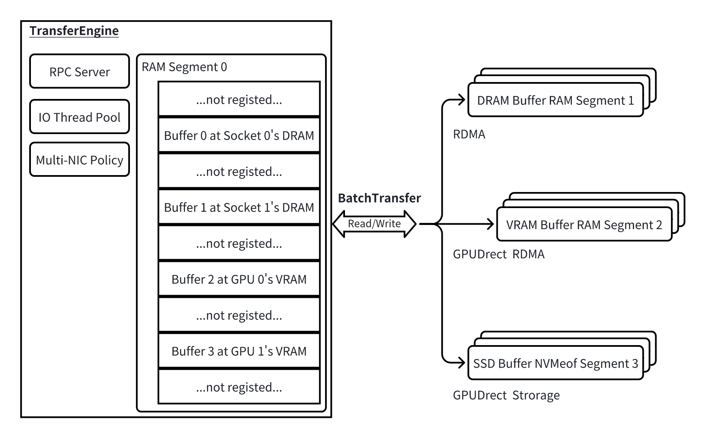
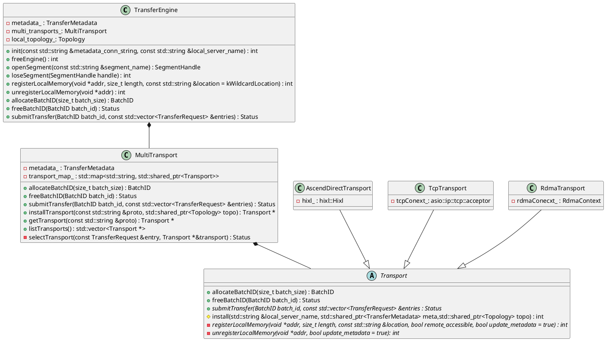

# Mooncake Transfer Engine

## 1. 概述

Mooncake Transfer Engine(TE) 是一个高性能、零拷贝的的数据传输库，它提供了以下两个核心概念：
- **Segment**：代表一个连续地址空间，可远端读写；它可以是由 DRAM 或 VRAM 提供的非持久性存储（称为 RAM Segment），也可以是由 NVMeof 提供的持久性存储（称为 NVMeof Segment）。
- **BtachTransfer**：封装了操作请求，专门负责在一个 Segment 中的一组不连续数据空间与另一组 Segment 中的相应空间之间同步数据，支持双向读写，因此其作用类似于异步且更灵活的 AllScatter/AllGather。



## 2. API

`TE` 的关键 API 如下：

```cpp
class TransferEngine {
   public:
    /// 初始化 `TE`.
    /// @param[in] metadata_conn_string 元数据服务的IP:PORT
    /// @param[in] local_server_name 分配给 `TE` 的IP，例如 192.168.1.1
    /// @param[in] ip_or_host_name 废弃参数
    /// @param[in] rpc_port 废弃参数
    int init(const std::string &metadata_conn_string,
             const std::string &local_server_name,
             const std::string &ip_or_host_name = "",
             uint64_t rpc_port = 12345);

    /// 释放 `TE` 的资源
    int freeEngine();

    /// 获取 Global Segment 的 handler，读写远端数据时需要先持有 handler
    SegmentHandle openSegment(const std::string &segment_name);

    /// 关闭 Global Segment
    int closeSegment(SegmentHandle handle);

    /// 注册本地内存为 Global Segment
    /// @param[in] addr 内存/显存指针
    /// @param[in] location CPU/NPU/GPU 或者宽匹配
    /// @param[in] remote_accessible 无效参数
    /// @param[in] update_metadata 上报为 Global Segment
    int registerLocalMemory(void *addr, size_t length,
                            const std::string &location = kWildcardLocation,
                            bool remote_accessible = true,
                            bool update_metadata = true);

    /// 解注册内存
    int unregisterLocalMemory(void *addr, bool update_metadata = true);

    /// 分配batch id，在执行 `TE` 传输任务之前都需要持有一个 batch id
    BatchID allocateBatchID(size_t batch_size);

    /// 释放batch id
    Status freeBatchID(BatchID batch_id);

    /// 提交传输任务，该函数为异步接口
    Status submitTransfer(BatchID batch_id,
                          const std::vector<TransferRequest> &entries);
};
```

## 3. Example

## 4. 类图



